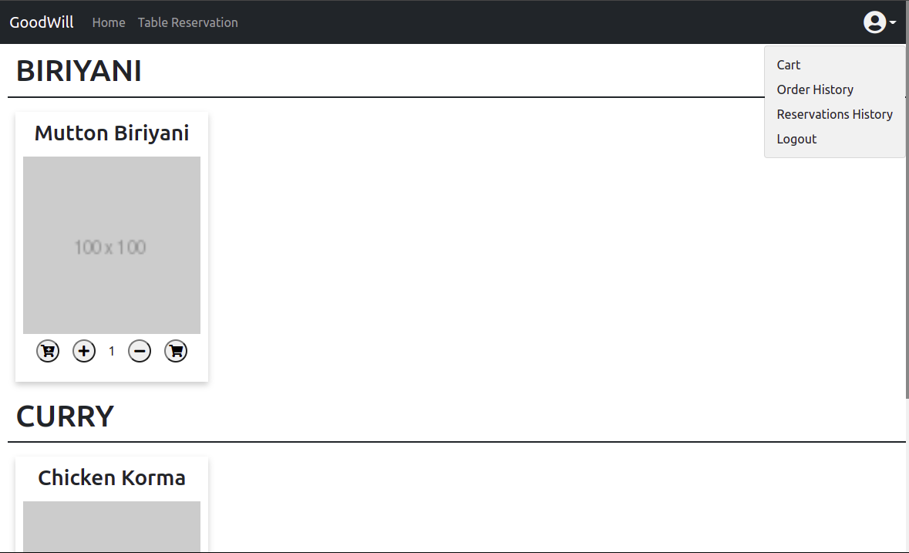
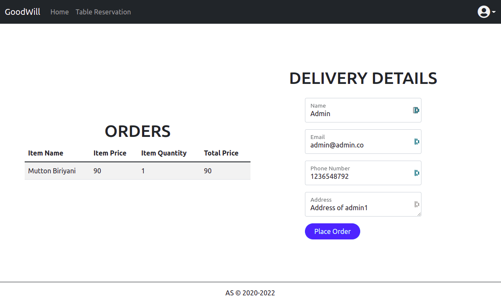
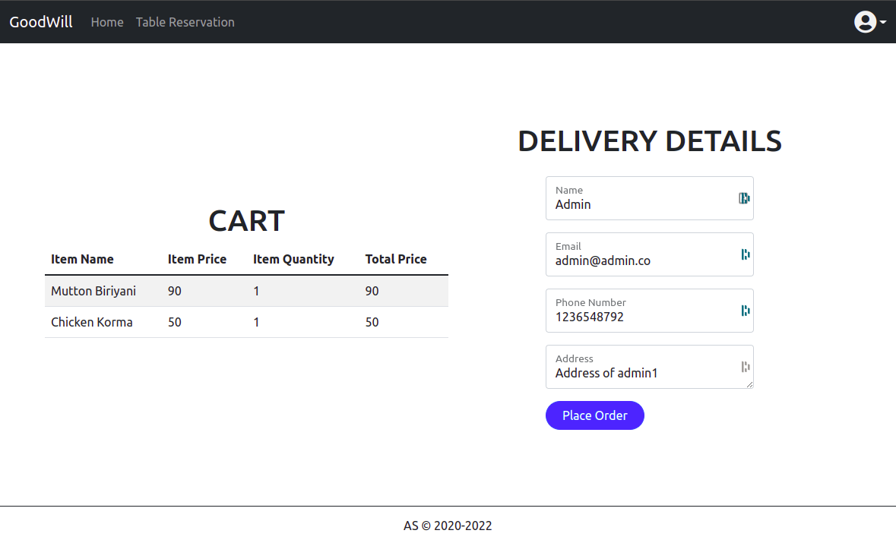
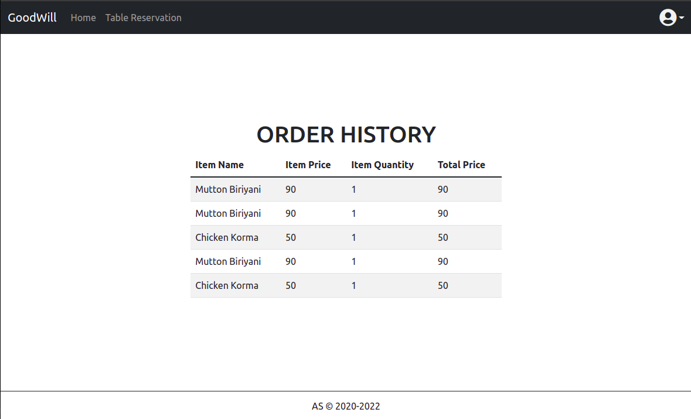
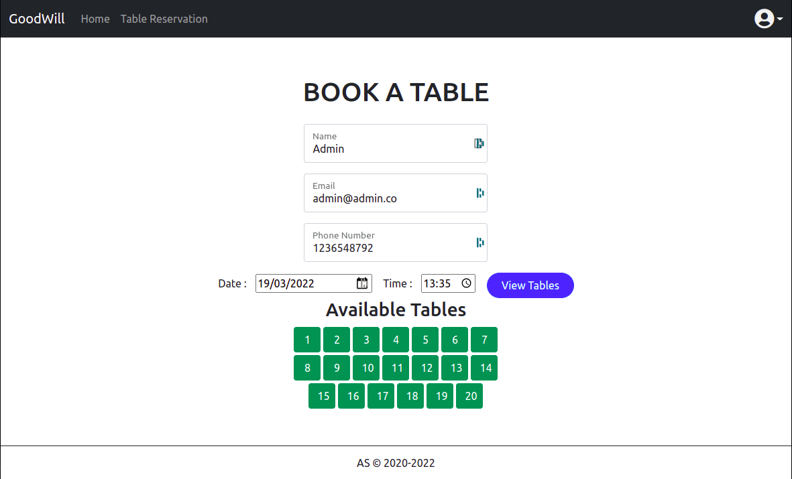
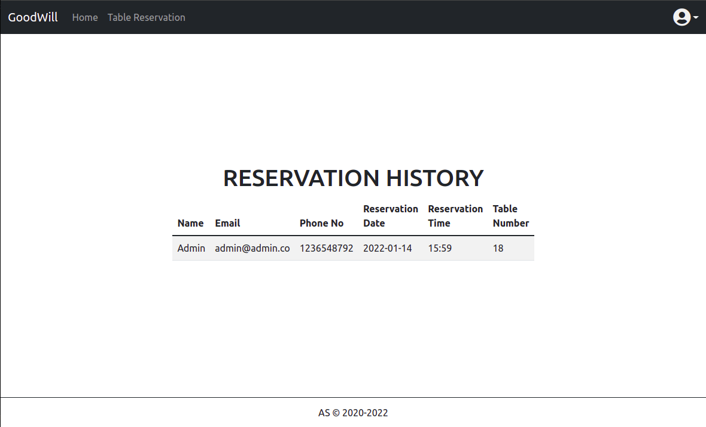
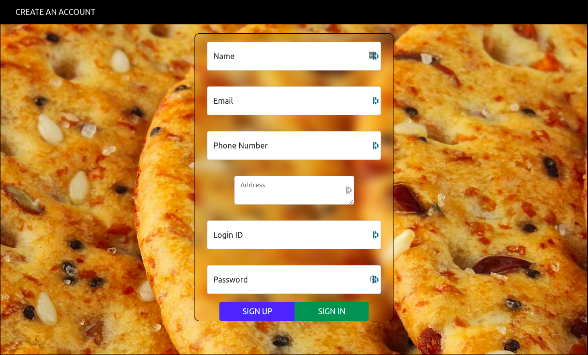
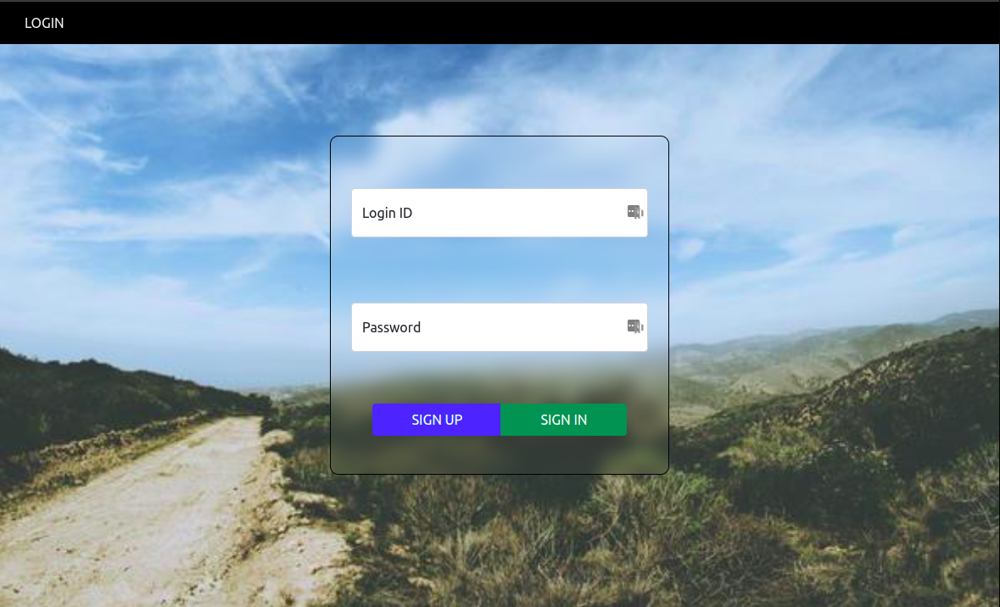

# GoodWill Restaurant - Website

This is an online website for a (ficticious) restaurant.

The main features of the website are :
- User can view the restaurant's menu

- User can order food from the menu

- User can use a Cart to shop food

- User can view his/her Order history

- User can do a table reservation online

- User can view table reservation history

- Note : To order food and make table reservations user must create a account and login using that account

Tech Used : HTML & CSS, JavaScript ( also jQuery ), PHP, SQLite.